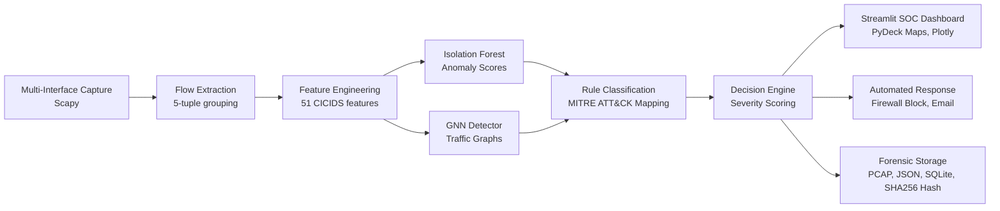

# AINTA Architecture

```mermaid
graph LR
  A[Multi-Interface Capture<br/>Scapy] --> B[Flow Extraction<br/>5-tuple grouping]
  B --> C[Feature Engineering<br/>51 CICIDS features]
  C --> D[Isolation Forest<br/>Anomaly Scores]
  C --> E[GNN Detector<br/>Traffic Graphs]
  D --> F[Rule Classification<br/>MITRE ATT&CK Mapping]
  E --> F
  F --> G[Decision Engine<br/>Severity Scoring]
  G --> H[Streamlit SOC Dashboard<br/>PyDeck Maps, Plotly]
  G --> I[Automated Response<br/>Firewall Block, Email]
  G --> J[Forensic Storage<br/>PCAP, JSON, SQLite, SHA256 Hash]
```

**Components**:
- src/capture: Multi-interface
- src/detection: ML + Rules
- dashboard.py: SOC UI
- Docker: Reproducible

 <!-- Generate with PlantUML -->

