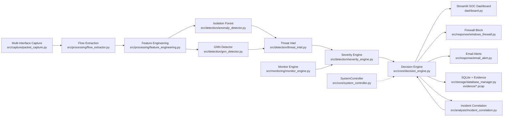
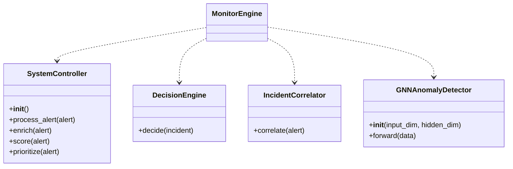
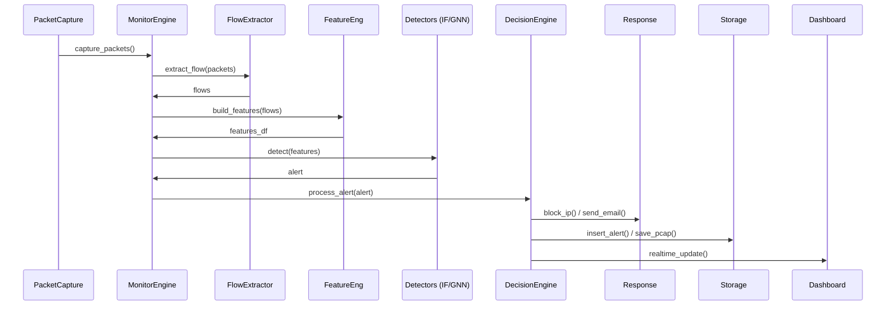
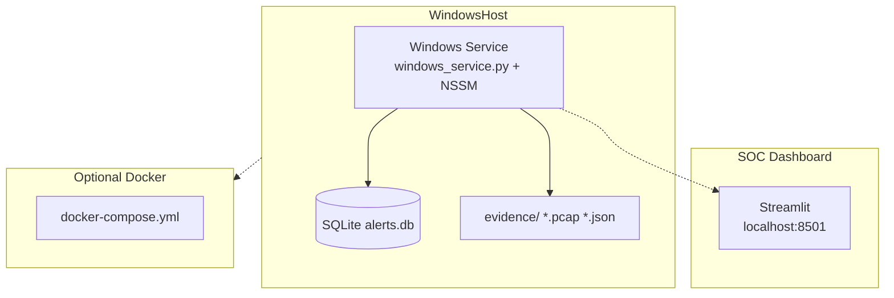

# AINTA UML Diagrams

## 1. Component Diagram

## 2. Class Diagram

## 3. Sequence Diagram - Threat Detection Flow

## 4. Deployment Diagram

**Usage**:
- VSCode: Install Mermaid Preview extension.
- Online: mermaid.live
- PlantUML: Convert Mermaid or use VSCode PlantUML extension.
- Update docs/architecture.md: ``

